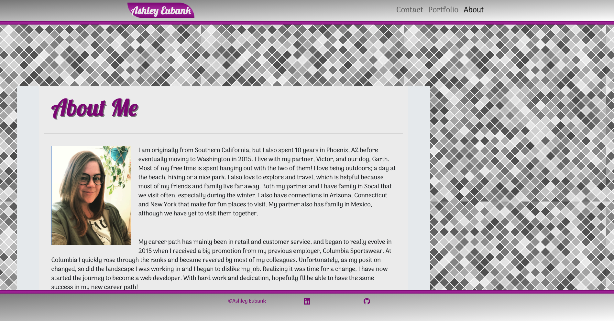
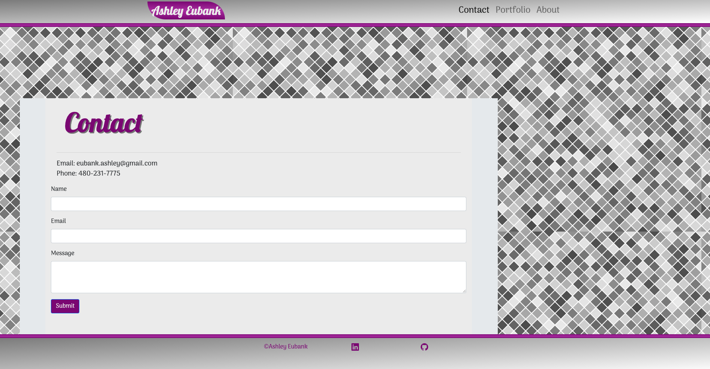
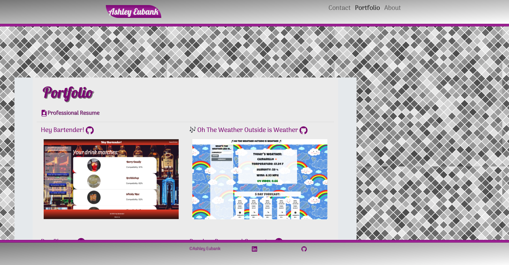

# Responsive-Portfolio-Update

For this assignment we were asked to create a responsive portfolio website using HTML, CSS and CSS Bootsrap. Thanks to a combination of skills learned from the class, I was able to accomplish this task.

I utilized Bootstrap for most of the styling, but also created an additional CSS style sheet to over-write Boostrap code for different effects/layout, as well as added my own personal styling. 

The layout is responsive on mobile and features some of my completed projects. There are links to deployed sites and the associated github repo. I've also included a link to a pdf of my resume and links to my personal github page and LinkedIn profile. 

# Resources Used:
* Materials from class repo
* Tutor sessions
* Information from [Stack Overflow](https://stackoverflow.com/) and [W3 Schools](https://www.w3schools.com/)
* Styling components from [Bootstrap CSS](https://getbootstrap.com/) and [Google Fonts](https://fonts.google.com/)

# Deployed Site:
[Ashley Eubank Portfolio](https://eubank87.github.io/responsive-portfolio-hw/)

